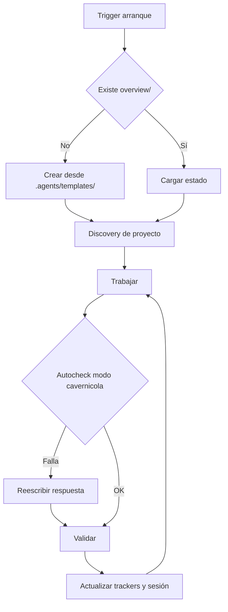

# Core Brain

## Ciclo

## Triggers de arranque

Las siguientes señales disparan el protocolo completo de bootstrap (discovery + crear `overview/` si falta + mapear archivos existentes):

- Frase **"ejecuta .agents"** → dispara el Protocolo de Auditoría de Learning (ver abajo).
- Inicio de sesión en cualquier proyecto con `.agents/` presente.
- Mensaje del usuario que mencione "nuevo proyecto", "inicializar", "bootstrap" o similar.
- Ausencia de `overview/session.md` al comenzar cualquier tarea de código.
- Primer mensaje de una conversación cuando el proyecto tiene `.agents/` pero no tiene `overview/`.
- **Mensaje que comienza con `$`** → reconocer como $-comando y ejecutar protocolo definido en `core/commands.md` sin bootstrap completo previo.

## Protocolo "ejecuta .agents"

Cuando el usuario escribe **"ejecuta .agents"** (o variante como "corre .agents", "bootstrap .agents"):

1. **Leer el core completo**: `path_map.md`, `communication.md`, `brain.md`, `commands.md` y `AGENTS.md`.
2. **Auditar y comparar `overview/learning.md` contra `.agents/core/` (Evaluación de 3 Vías)**:
   Por cada bullet en `## 📌 Propuestas de mejora`, evaluar si la propuesta fue:
   - ✅ **Aplicada**: Ya está implementada o integrada en la gobernanza/core actual → promover al final de `## 📜 Histórico de mejoras aplicadas` con formato `- [YYYY-MM-DD] Descripción breve` y eliminar el bullet activo.
   - ❌ **Rechazada**: Viola el **Filtro Agnóstico (Escudo Anti-parches)** (contiene código fuente específico, propiedades UI o comandos CLI rígidos) o es inviable → eliminar o registrar motivo de rechazo.
   - ⚠️ **En Conflicto**: Entra en conflicto directo con una regla existente en `.agents/core/` → marcar con el flag `[conflicto learning: regla X]` en `work.md` para aclaración del usuario.
   - ⏳ **Pendiente**: Cumple el filtro agnóstico y no está aplicada ni en conflicto → conservar en `## 📌 Propuestas de mejora`.
3. **Continuar con el flujo normal del core**: Inicio → Discovery → verificar `overview/` → trabajar.

## Inicio

- Ejecutar `git submodule status`.
- Leer core y `overview/session.md`, `overview/work.md`, `overview/work/tasks.md`, `overview/work/deuda_tecnica.md`, `overview/work/pendientes.md`, `overview/trackers/progress.md` y reportes de skills en `overview/work/skill/`.
- Si falta `overview/` o archivos base, crearlos desde `.agents/templates/`.
- Si falta `overview/architecture.md`, crearlo desde plantilla antes de trabajar.
- **Orden de prioridad de atención en `$work`**: 
  1. `overview/work/tasks.md` (tarea activa en ejecución)
  2. `overview/work/pendientes.md` (ítems de seguimiento identificados)
  3. `overview/work/deuda_tecnica.md` (deuda ordenada por prioridad **Alta**, **Media** y **Baja**)
- **Histórico de completados**: Al resolver cualquier ítem (tarea, bug o deuda), retirarlo inmediatamente de las tablas activas y trasladarlo a la sección `## ✅ Completados (Historial)` en `work.md`, `deuda_tecnica.md` y `pendientes.md` conservando su ID (`[w1]`, `[d2]`, `[p1]`).
- **Alias divergentes en bootstrap**: si coexisten pares alias/canónico (`tasks.md`/`work.md`, `tracker.md`/`trackers/architecture.md`, `memory_session.md`/`session.md`) con contenido distinto → flag obligatorio `[consolidar alias]` en `work.md`; **nunca** asumir cuál manda sin verificar diff previo.
- **`session.md` legado vs plantilla**: si faltan campos o encabezados requeridos (`Agente:`, `## Reanudar`, `## Cambios`) → reportar en boot `session legado` sin forzar migración automática implícita.
- **Auditoría de líneas (discovery/`$boot`)**: listar archivos de código fuente >250L; sugerir IDs `deuda` en `overview/work/deuda_tecnica.md` ordenadas por prioridad (**Alta**, **Media**, **Baja**); no crear filas fijas sin confirmación implícita de la tarea.
- **Registro preventivo previo a ejecución (Pre-execution Work Logging)**: Al recibir un requerimiento o bug, actualizar de forma automática y simultánea los archivos de control de `overview/` (`work.md`, `work/tasks.md`, `session.md`, `pendientes.md`, `deuda_tecnica.md`, `work_review.md` y `architecture.md`) INMEDIATAMENTE antes de ejecutar cualquier acción, sin requerir recordatorio manual del usuario. En `tasks.md`, describir la tarea a iniciar, clasificarla (`problema`, `mejora`, `refactor`) y proponer hipótesis/soluciones o rutas de trabajo. En caso de reporte de bug, incluir una hipótesis breve de causa raíz (5-7 palabras). Derivar automáticamente 1 o 2 mejoras/tareas asociadas a los pendientes para garantizar tolerancia a desconexión, corte de luz o agotamiento de tokens.
- **Backlog canónico único**: `overview/work.md` es el único índice maestro de IDs; los detalles de tareas activas van en `overview/work/tasks.md`, los pendientes identificados al cerrar en `overview/work/pendientes.md` y la deuda técnica en `overview/work/deuda_tecnica.md`. No duplicar en alias `tasks.md`.
- **Triaje e Integración Activa de Skills (`overview/work/skill/`)**: Durante `$boot`, `$work` y `$close`, el agente escanea obligatoriamente la carpeta `overview/work/skill/` en busca de reportes `.md` generados por las skills instaladas en `.skill/`. Cada hallazgo en dichos reportes se triaja e integra automáticamente en `overview/work/deuda_tecnica.md` (refactores/arquitectura), `overview/work/pendientes.md` (features/secundarios) o `overview/work/tasks.md` (bugs/urgentes), conservando el archivo `overview/work/skill/<skill-name>.md` como fuente de verdad con la evidencia completa provista por la skill.
- **Protocolo de Revisión de Trabajo (`work_review.md`)**: Al finalizar `$boot`, ejecutar obligatoriamente el protocolo definido en `templates/work_review.md` para auditar `overview/work/` y reportar un síntesis de 4 líneas.
- **Historial de Intentos firmado por Agente**: En `work.md` y trackers de bugs/tareas, mantener un registro incremental de intentos de resolución. Nunca borrar intentos previos. Reglas:
  - **Mismo día:** actualizar la entrada existente de esa fecha (sin duplicar).
  - **Diferente día:** crear nueva entrada con fecha + **firma del Agente** (modelo/versión) que ejecutó la prueba.
  - **Al resolver:** marcar estado como `hecho` indicando el Agente que logró la solución. Incluir nota concisa con (1) causa raíz exacta y (2) solución aplicada (código/configuración).
  - **Propósito:** ante problema similar futuro, consultar historial para reusar la solución exitosa o recomendar al agente que la resolvió.

### Discovery dinámico por framework

1. Identificar framework del proyecto (Kotlin → `build.gradle.kts / settings.gradle.kts`; Node → `package.json`; etc.).
2. Comparar carpetas raíz contra las carpetas estándar conocidas del framework (para Kotlin, consultar `.agents/knowledge/kotlin_structure.md`).
3. Inspección recursiva automática de toda carpeta no estándar: identificar de forma estricta las carpetas estándar del framework detectado y procesar automáticamente cualquier otro directorio raíz (incluyendo subcarpetas anidadas) mediante inspección semántica de contenido para su relocalización a `overview/` sin omitir ninguna por ser no-estándar.
4. Relocalización activa de metadatos: no ignorar archivos sin categoría; extraer y relocalizar documentación, notas de negocio o trackers hallados en subdirectorios no estándar a `overview/context/` o al tracker canónico correspondiente para cero archivos huérfanos.
5. **Lectura activa de contexto (`overview/context/`)**: El protocolo de inicio debe inspeccionar y leer automáticamente los archivos de contexto guardados en `overview/context/` (changelogs, tablas de datos, reglas de negocio) para recuperar el estado histórico y checkpoints del proyecto al reanudar.
6. **Auto-inicialización de trackers de contenido externo (`content_*.md`)**: Al detectar manejo o extracción de datos de dominio (ej. catálogo de datos / colecciones masivas), el bootstrap debe crear e inicializar automáticamente los trackers `content_gemini.md`, `content_claude.md`, `content_gpt.md` y `content_verified.md` desde `.agents/templates/trackers/`.
7. **Exploración progresiva del sistema**: La cartografía del proyecto debe desarrollarse de forma incremental y contextual, evitando una revisión exhaustiva de todo el código en una sola pasada. Las zonas nuevas del mapa se incorporan conforme el trabajo las requiere, preservando una visión clara del alcance real de la tarea sin sobreexplorar el repositorio. **Guardrail de tokens en discovery inicial:** leer máx 5 archivos de código fuente en el primer sweep; expandir solo cuando la tarea lo requiera explícitamente.

### Reconocimiento de acrónimos estándar

Reconocer automáticamente sin listas rígidas: `i18n`, `l10n`, `auth`, `routes`, `api`, `dto`, `repo`, `vm`, `bloc`, `di`, `ioc`, `ci`, `cd`, `qa`, `ux`, `sdk`, `orm`, `rbac`, `jwt`, `ssr`, `csr`. Si aparece un acrónimo desconocido → buscar en contexto del proyecto antes de preguntar.

### Clasificación semántica por contenido

Al encontrar cualquier carpeta o archivo no mapeado al framework, inspeccionar su contenido interno independientemente del nombre de la carpeta:

| Señales en contenido | Clasificar como |
|---|---|
| Fechas, `## Sesión`, `## Objetivo` | `overview/history/` |
| `- [ ]`, `- [x]`, progreso, estado | `overview/trackers/` |
| Resúmenes ejecutivos, arquitectura | `overview/architecture.md` |
| Contexto de negocio, datos de dominio | `overview/context/` |
| Flujos de dominio (pasos agnósticos: origen→procesamiento→destino) | `overview/workflows/` |
| Mejoras al core, candidatos | `overview/learning.md` |

### Normalización de rutas

- Todas las rutas de `overview/` siempre en minúsculas: `overview/`, `overview/trackers/`, `overview/history/`, `overview/context/`, `overview/workflows/`, `overview/work/`.
- Si existe colisión (`Overview/` vs `overview/`): mapear alias, usar ruta lowercase como canónica.
- En Linux/Mac (case-sensitive): verificar con `ls` antes de asumir que no existe.

### Política de relocalización activa y no ignorar

Ningún archivo de documentación, notas de negocio o tracker hallado en subdirectorios no estándar puede ignorarse silenciosamente o quedar huérfano. Opciones:

1. Mapeado a categoría conocida → relocalizar/consolidar en `overview/`, `overview/trackers/` u `overview/history/`.
2. Contexto de dominio o metadatos sueltos → extraer y relocalizar activamente a `overview/context/`.
3. Ambiguo → referenciar en `overview/work.md` con nota `[pendiente clasificar]`.

## Handoff de Agente

Cuando el Agente que retoma una sesión es distinto al que la inició (diferente modelo o proveedor):

1. **Identificar cambio**: comparar `Agente:` en `overview/session.md` con el modelo actual. Si difieren → activar protocolo de handoff.
2. **Validar estado previo**: leer `## Reanudar` de `session.md` y verificar que el `Contexto crítico` es coherente con el estado actual de los archivos mencionados. Si hay inconsistencia, anotar en `work.md` antes de continuar.
3. **No asumir correctitud**: el Agente entrante no da por válido el trabajo del anterior sin verificación. Inspeccionar el último cambio registrado en `## Cambios` y confirmar que el archivo/función afectado existe y compila.
4. **Registrar handoff**: al comenzar a trabajar, actualizar `session.md`:
   - `Agente que reanuda:` con la firma propia (formato `core/communication.md §3`).
   - Añadir bullet en `## Cambios`: `- Handoff de [Agente anterior] → [Agente actual].`
5. **Historial de intentos**: si hay bugs abiertos en `work.md`, revisar el historial de intentos antes de proponer solución — el agente anterior puede haber intentado el mismo enfoque.

> Propósito: evitar trabajo duplicado, detectar inconsistencias de estado y aprovechar el historial firmado para elegir el enfoque más efectivo.

## Arquitectura viva y Mapeo Incremental por Tarea

- **Arquitectura viva en `overview/architecture.md`**: El proyecto debe mantener un mapa operativo completo y exhaustivo de hasta el último rincón del repositorio (pantallas, clases, widgets, services, providers, repos y modelos). Debe plasmarse mediante diagramas sintéticos Mermaid (`graph LR` / `graph TD`) y tablas de conexiones clave, omitiendo bloques de texto redundantes para permitir rápida lectura y fácil rastreo de conexiones del agente.
- **Mapeo incremental de arquitectura por `$work`**: Al registrar o iniciar una tarea, el agente debe actualizar `overview/architecture.md` mapeando incrementalmente los nodos y conexiones que dicha tarea toca o modifica, asegurando que el mapa evolucione sin perder detalle.
- **Comando y Trigger `$archi` (Exhaustividad de Arquitectura Viva)**: Comando dedicado exclusivamente a auditar, escanear y registrar hasta el último rincón del proyecto en `overview/architecture.md`. Si el mapeo en `$work` no cubrió la totalidad de los componentes modificados o nuevos, `$archi` debe ejecutar el escaneo estructural completo para garantizar cobertura del 100% de la arquitectura viva mediante diagramas Mermaid sintéticos.
- **Modularización de Trackers por Subcarpetas / Archivo Individual**: Para colecciones masivas de datos, los trackers de contenido deben modularizarse en directorios (`overview/trackers/content/<categoria>/<item>.md`) y el contenido verificado mapearse directamente a la estructura final en app.

## Cierre

- Ejecutar `./gradlew lint` cuando aplique.
- **Suite de tests (sin carpeta `test/`)**: Si el proyecto **no posee** carpeta o suite de pruebas (`test/`) → el estado de validación de pruebas es `no aplica` (no representa una deuda técnica). Si la suite de tests **sí existe** pero no fue ejecutada o falló → estado `no verificado` + motivo explícito. Evitar marcar un fallo de ejecución del CLI por suite ausente como una deuda falsa.
- **Sincronización Automática de Rastreadores**: Es regla obligatoria en el cierre (`$close`) la actualización simultánea y automática de todos los archivos de control en `overview/` (`pendientes.md`, `deuda_tecnica.md`, `tasks.md`, `session.md`, `work_review.md`, `work.md` y `architecture.md`) sin requerir recordatorio manual por parte del usuario.
- **Pendientes de sesión**: registrar cualquier ítem o tarea secundaria identificada durante la ejecución en `overview/work/pendientes.md` para su seguimiento en sesiones posteriores.
- Actualizar tracker correspondiente, sesión e índice maestro `overview/work.md`. Si se resolvió un bug/tarea con historial de intentos, registrar firma del Agente resolvedor, causa raíz y solución en la entrada correspondiente. Retirar cualquier ítem resuelto inmediatamente de las tablas activas y trasladarlo a `## ✅ Completados (Historial)` en `work.md`, `deuda_tecnica.md` y `pendientes.md` conservando su ID.
- Si validación falla o no puede ejecutarse (habiendo suite): marcar `no verificado`, indicar motivo; nunca presentar como validado.
- Archivar sesiones antiguas en `overview/history/` cuando dejen de ser útiles al contexto activo.
- **Inviolabilidad estricta de `.agents/`**: Nunca modificar directamente archivos de gobernanza o comandos en `.agents/` desde un proyecto local. Todos los aprendizajes candidatos deben plasmarse únicamente en `overview/learning.md` bajo `## 📌 Propuestas de mejora`. Si hay mejora candidata al core: aplicar **Filtro Agnóstico** (prohibido sugerir código, propiedades de UI o comandos específicos; solo procesos de diagnóstico o gobernanza). Si pasa el filtro, agregar bullet a `overview/learning.md` (lista limpia, sin fechas/estados).
- Una vez promovida al repo oficial: mover al Histórico como una línea. Eliminar el bullet activo.

## Calidad y Resolución de Dependencias

- Cambios quirúrgicos. No mejorar código ajeno sin necesidad.
- Kotlin: Dependencias, frameworks y manejo de estado dependen de cada proyecto.
- Archivos Kotlin idealmente <250 líneas; máximo 300.
- **Resolución de dependencias vs SDK del entorno**: Si `./gradlew build / sync` falla por restricciones de versión entre Gradle Plugin y el SDK de Kotlin y el entorno instalado, preferir el **upgrade del entorno** cuando el proyecto requiere versiones modernas. El downgrade de paquetes debe considerarse únicamente como un parche temporal.

## Contenido externo

- Usar trackers separados: Gemini, Claude y GPT.
- `verificado` = 2+ agentes coinciden, fuentes compatibles y sin conflicto abierto.
- Registrar resultado breve, fuentes y fecha. Si hay conflicto, marcar `conflicto`.

