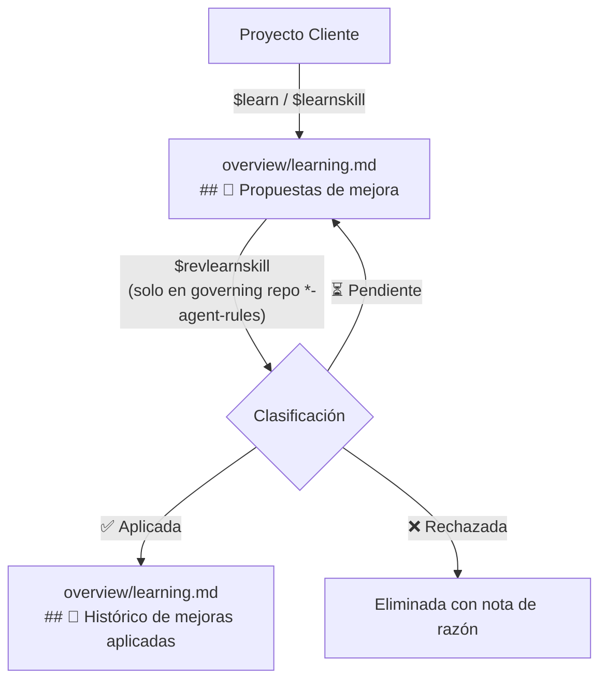

# 📋 Protocolo de Aprendizaje Inmutable

## 🔒 Principio de Inviolabilidad Absoluta

> **REGLA MÁXIMA DEL ECOSISTEMA — INVIOLABLE:**
> Ningún agente ni proyecto cliente puede **jamás** modificar, editar, reemplazar o sobrescribir archivos dentro de `.agents/` ni `.skill/`.
>
> - `.agents/` → Repositorio de gobernanza de **solo lectura** para el proyecto cliente.
> - `.skill/` → Skills instaladas como submódulos Git de **solo lectura** para el proyecto cliente.
>
> **Todo flujo de aprendizaje, propuesta o mejora generada por el agente o por la ejecución de skills debe registrarse EXCLUSIVAMENTE en `overview/learning.md` del proyecto.** Nunca en `.agents/` ni en `.skill/`.

---

## ⚡ Comandos del Protocolo de Aprendizaje

### `$learn [texto]`
**Propósito**: Registrar un aprendizaje general candidato (agnóstico de skill) desde cualquier proyecto.

**Protocolo**:
1. Validar texto con el **Filtro Agnóstico** (`brain.md`): abstraer código, nombres de módulos y rutas específicas. Si contiene código, convertir a principio de arquitectura.
2. Agregar en `overview/learning.md` bajo `## 📌 Propuestas de mejora`:
   ```
   - propuesta en términos agnósticos de arquitectura...
   ```
3. Si el archivo no existe, crearlo desde `templates/learning.md`.
4. Confirmar: `Aprendizaje registrado en overview/learning.md.`

---

### `$learnskill [nombre-skill] [texto]`
**Propósito**: Registrar en `overview/learning.md` una propuesta de mejora orientada a una skill específica, **sin tocar `.skill/` ni `.agents/` bajo ninguna circunstancia**.

**Protocolo**:
1. Identificar el nombre de la skill (ej: `i18n-agent-skill`, `monitoring-agent-skill`).
2. Agregar en `overview/learning.md` bajo `## 📌 Propuestas de mejora` con la **convención de etiquetado obligatoria**:
   ```
   - [nombre-skill] propuesta de mejora en términos descriptivos...
   ```
   Ejemplos:
   ```
   - [i18n-agent-skill] Agregar soporte para idioma PT-BR en la cascada de fallback.
   - [monitoring-agent-skill] El comando $monitor:audit no detecta módulos sin barrel export.
   ```
3. Confirmar: `Propuesta para [nombre-skill] registrada en overview/learning.md.`

---

### `$revlearnskill`
**Propósito**: Revisar y clasificar las propuestas etiquetadas `[nombre-skill]` dentro del `overview/learning.md` del **governing repo** (`*-agent-rules`). **Solo se ejecuta durante el `$boot` del repositorio oficial de gobernanza**.

**Todo el resultado de esta revisión queda en `overview/learning.md`. El agente no toca ningún otro repositorio ni submódulo.**

**Protocolo**:
1. Leer `overview/learning.md` del governing repo.
2. Para cada bullet `- [nombre-skill]` en `## 📌 Propuestas de mejora`:
   - ✅ **Aplicada**: La mejora ya fue documentada o incorporada → mover a `## 📜 Histórico de mejoras aplicadas` con fecha.
   - ❌ **Rechazada**: Es demasiado específica, viola el Filtro Agnóstico o no aplica → eliminar con nota de razón al final de la línea.
   - ⏳ **Pendiente**: Válida y aún no incorporada → conservar en `## 📌 Propuestas de mejora`.
3. Confirmar: `$revlearnskill completado. [N] aplicadas al Histórico, [N] pendientes, [N] rechazadas.`

> **Nota**: El agente documenta en `overview/learning.md`. La incorporación física de una mejora a la skill canónica la realiza el **mantenedor del repositorio** en el repo oficial de la skill — no el agente desde el proyecto.

---

## 📁 Estructura Canónica de `overview/learning.md`

```markdown
# 📚 Learning & Propuestas de Mejora

## 📌 Propuestas de mejora

- aprendizaje general agnóstico...
- [i18n-agent-skill] propuesta específica de la skill i18n...
- [monitoring-agent-skill] propuesta específica de monitoring...

## 📜 Histórico de mejoras aplicadas

- [YYYY-MM-DD] [nombre-skill] descripción breve de lo documentado.
```

---

## 🔁 Ciclo de Vida Completo



> **Todos los nodos terminan en `overview/learning.md`.** El agente nunca escribe en `.agents/` ni en `.skill/`.
