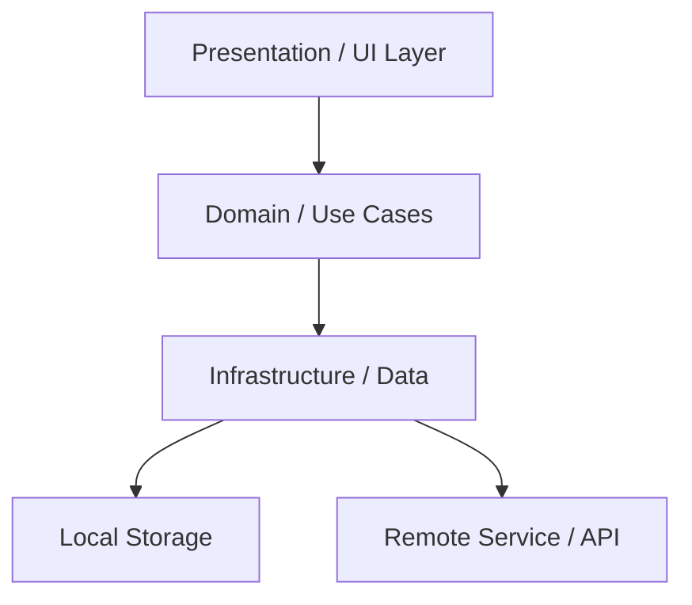

# 🏛️ Arquitectura Global del Proyecto — [Nombre del Proyecto]

> Última actualización: YYYY-MM-DD (Auditoría `$archi`: Cobertura 100% modularizada en `overview/architecture/`)

## 1. Visión General y Capas del Sistema

| Capa | Ubicación | Descripción Breve |
|---|---|---|
| **UI / Composables** | `presentation/` | Composables, ViewModels y StateFlow |
| **Domain** | `domain/` | Entidades puras y UseCases |
| **Data** | `data/` | Repositorios, Room DAOs y Retrofit |
| **Core** | `core/` | DI (Hilt), navegación y utilidades |

## 2. Diagrama de Estado y Persistencia Global

## 3. Índice de Módulos (Subdocumentos de Dominio)
* 📦 **[Módulo Principal](./overview/architecture/modules/principal.md):** Especificación técnica y flujo operativo principal.

## 4. Guías Transversales
* 🧭 **[Mapa Global de Rutas](./overview/architecture/routes_map.md)** — Enrutamiento y navegación del sistema.
* 🔄 **[Flujo de Datos](./overview/architecture/core/data_flow.md)** — Estado global, sync y persistencia.
* 📏 **[Reglas de Importación](./overview/architecture/core/import_rules.md)** — Convenciones de capas e importaciones.
