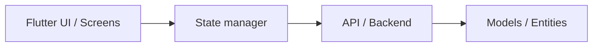

# Arquitectura del proyecto

Reemplazar con arquitectura real del proyecto al bootstrap.

```mermaid
graph LR
    UI[Flutter UI / Screens] --> State[State manager]
    State --> Service[API / Backend]
    Service --> Model[Models / Entities]
```

| Capa | Implementación real |
|---|---|
| Presentation | |
| Domain | |
| Data | |
